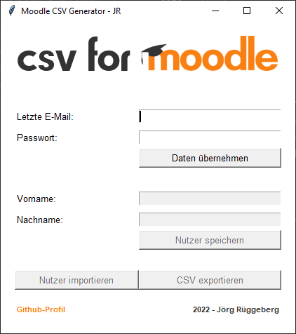
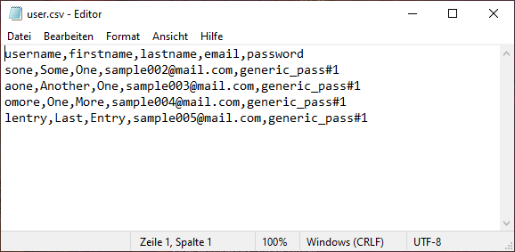

# User CSV Generator for Moodle - GUI Version

User CSV Generator for Moodle
This Script takes some user input:
- latest users e-mail address 
- desired password 

to generate ascending email-accounts and

- firstname
- lastname

for generating usernames.

This will generate a csv file with username, firstname, lastname, email address and password for uploading to an existing Moodle user database.

*Sample Output*

---
User import not yet implemented
